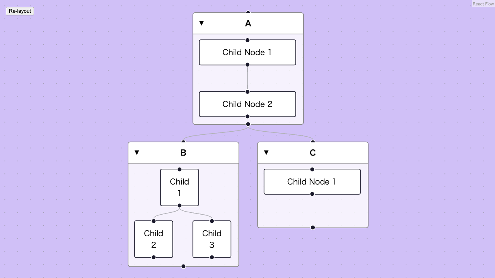
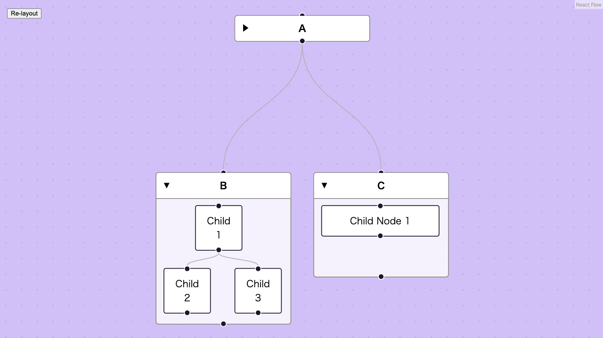

# react-flow-sub-flows-sample

A [React Flow](https://reactflow.dev) demo combining sub-flow grouping, collapsible group nodes, and automatic two-level Dagre layout — a reference for developers implementing these patterns together.





## Features

- **Sub-flow grouping** — child nodes are contained within parent group nodes using `parentId` and `extent: 'parent'`
- **Collapsible groups** — a custom `GroupNode` component with a fold/unfold toggle that hides children and collapses the bounding box to a header bar
- **Two-level auto-layout** — a Dagre-based layout that first arranges children within each group, then positions groups relative to each other; collapsed groups are correctly sized at layout time

## Getting started

```bash
npm install
npm run dev   # http://localhost:5173
```

## References

- [Try it on StackBlitz](https://stackblitz.com/~/github.com/110chang/react-flow-sub-flows-sample)
- [React Flow sub-flows documentation](https://reactflow.dev/learn/concepts/sub-flows)
